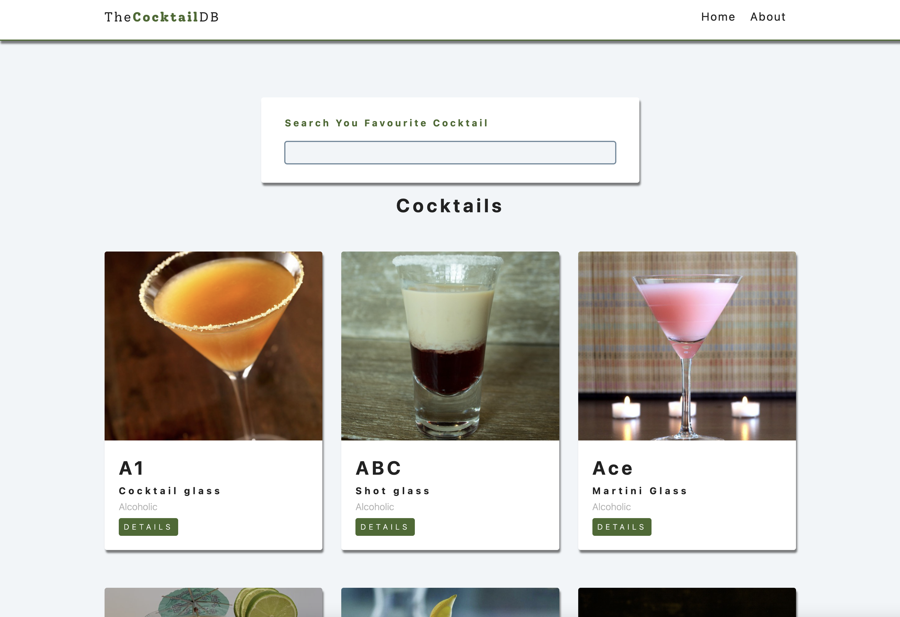

# CocktailsDB React

To start project

1. Download or clone git repository

2. Install dependencies `npm install`

3. Start server `npm start`

---

Completed [project](https://cocktail-db-by-malina.netlify.app/)

---

#### Screenshots



#### React Router Fix

(Fix)[https://dev.to/dance2die/page-not-found-on-netlify-with-react-router-58mc]

#### CRA Fix

```

"build": "CI= react-scripts build",

```
